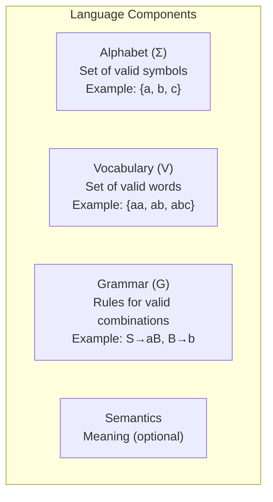
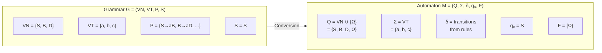
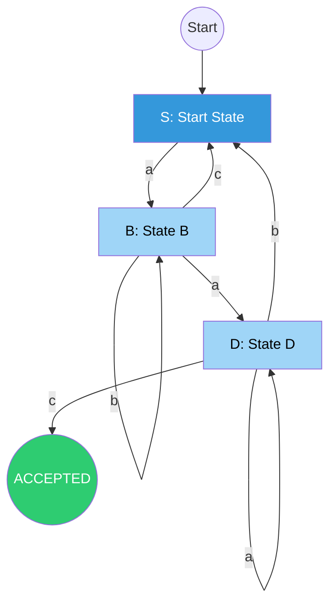
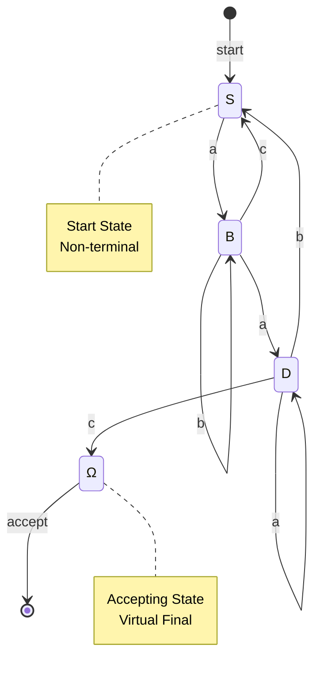
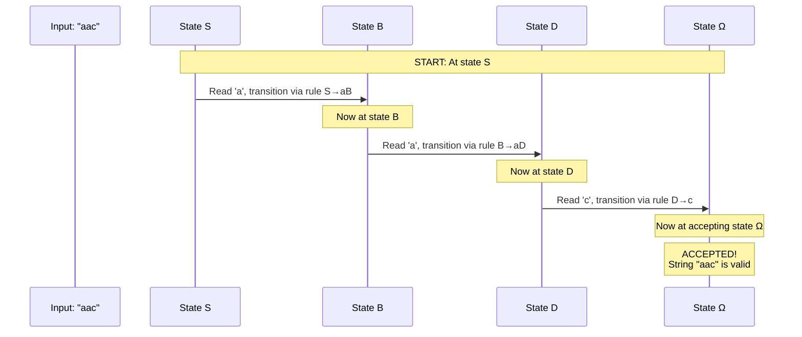
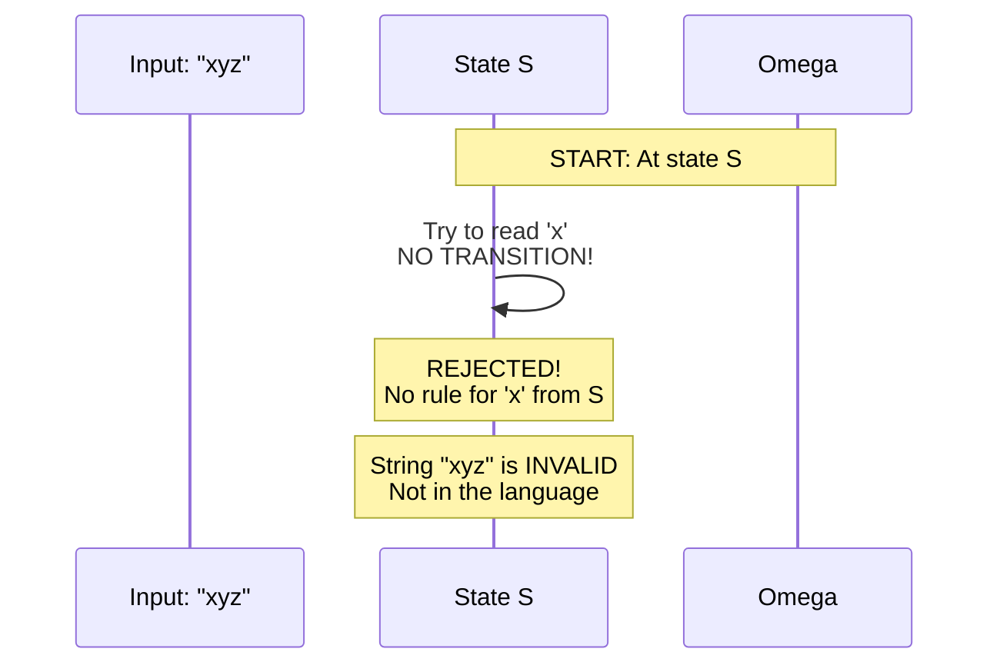

# Laboratory Work Presentation Script
## Topic: Regular Grammars and Finite Automata

---

## TABLE OF CONTENTS

1. [Introduction - What is This Lab About?](#1-introduction---what-is-this-lab-about)
2. [Theoretical Background](#2-theoretical-background)
3. [Project Structure Overview](#3-project-structure-overview)
4. [FIXING THE PYTEST ERROR - CRITICAL](#4-fixing-the-pytest-error---critical)
5. [Step-by-Step Presentation Commands](#5-step-by-step-presentation-commands)
6. [Code Deep Dive](#6-code-deep-dive)
7. [Mermaid Visualizations](#7-mermaid-visualizations)
8. [Testing & Verification](#8-testing--verification)
9. [Summary & Conclusion](#9-summary--conclusion)

---

## 1. INTRODUCTION - WHAT IS THIS LAB ABOUT?

### What Are We Building?

This laboratory work demonstrates the **equivalence between two fundamental concepts** in formal language theory:

```
┌─────────────────────────────────────────────────────────────────┐
│                    REGULAR GRAMMAR (Generator)                  │
│  "Defines RULES to CREATE strings"                              │
│                                                                 │
│     S → aB     (Start at S, can go to 'a' then B)               │
│     B → bB     (At B, can go to 'b' then B again)               │
│     B → c      (At B, can end with 'c')                         │
│                                                                 │
│  OUTPUT: Generates strings like "abac", "aac", "bc"             │
└─────────────────────────────────────────────────────────────────┘
                              ↕ CONVERSION
                              ↕ (Our Code!)
                              ↕
┌─────────────────────────────────────────────────────────────────┐
│               FINITE AUTOMATON (Acceptor/Discriminator)         │
│  "Defines STATES to VALIDATE strings"                           │
│                                                                 │
│     States: {S, B, D, Ω}                                        │
│     Start: S                                                    │
│     Accepting: {Ω}                                              │
│                                                                 │
│  OUTPUT: Accepts/Rejects strings like a classifier              │
└─────────────────────────────────────────────────────────────────┘
```

### Why Is This Important?

| Concept        | Real-World Analogy | Purpose                            |
| -------------- | ------------------ | ---------------------------------- |
| **Grammar**    | Recipe             | Defines HOW to make something      |
| **Automaton**  | Quality Checker    | Verifies IF something is valid     |
| **Conversion** | Recipe ↔ Checker   | Ensures they agree on what's valid |

**In Machine Learning terms:**
- Grammar = Generator (like in GAN)
- Automaton = Discriminator (like in GAN)

---

## 2. THEORETICAL BACKGROUND

### 2.1 Formal Language Definition

A **formal language** has 4 components:



### 2.2 Regular Grammar Formal Definition

A Regular Grammar is a 4-tuple: **G = (V_N, V_T, P, S)**

| Symbol  | Meaning                   | In Our Project      |
| ------- | ------------------------- | ------------------- |
| **V_N** | Non-terminals (variables) | `{S, B, D}`         |
| **V_T** | Terminals (alphabet)      | `{a, b, c}`         |
| **P**   | Production rules          | `{S→aB, B→aD, ...}` |
| **S**   | Start symbol              | `S`                 |

**Right-Linear Rule:** Each rule must be in form:
- `A → aB` (terminal + non-terminal)
- `A → a` (terminal only)

### 2.3 Finite Automaton Formal Definition

A Deterministic Finite Automaton (DFA) is a 5-tuple: **M = (Q, Σ, δ, q₀, F)**

| Symbol | Meaning             | In Our Project              |
| ------ | ------------------- | --------------------------- |
| **Q**  | Set of states       | `{S, B, D, Ω}`              |
| **Σ**  | Input alphabet      | `{a, b, c}`                 |
| **δ**  | Transition function | `{ (S,a)→B, (B,a)→D, ... }` |
| **q₀** | Start state         | `S`                         |
| **F**  | Accepting states    | `{Ω}`                       |

### 2.4 Conversion: Grammar → Automaton



---

## 3. PROJECT STRUCTURE OVERVIEW

```
1_RegularGrammars/
├── config/
│   └── variant_13.json          # Grammar definition (YOUR variant!)
├── src/
│   ├── __init__.py             # Makes 'src' a package
│   ├── grammar.py              # Grammar class - generates strings
│   ├── automaton.py            # Automaton class - validates strings
│   └── visualizer.py          # Draws automaton graph
├── tests/
│   └── test_pipeline.py        # Unit tests
├── main.py                     # CLI interface
├── requirements.txt            # Dependencies
├── automaton.png              # Generated visualization
└── README.md                  # Project documentation
```

### File Purposes:

| File                     | Purpose                                                      |
| ------------------------ | ------------------------------------------------------------ |
| `config/variant_13.json` | **Your grammar rules** - this defines what strings are valid |
| `src/grammar.py`         | **Grammar class** - can GENERATE valid strings               |
| `src/automaton.py`       | **Automaton class** - can VALIDATE/CHECK strings             |
| `src/visualizer.py`      | **Visualizer** - draws the automaton as a graph              |
| `main.py`                | **CLI tool** - run commands to test everything               |
| `tests/test_pipeline.py` | **Tests** - verify everything works correctly                |

---

## 5. STEP-BY-STEP COMMANDS

### STEP 1: Environment Setup

```bash
# Navigate to project directory
cd D:\uni\year2\dsllab\1_RegularGrammars

# Install dependencies
pip install -r requirements.txt

# Install package in development mode (FIXES IMPORT ERROR!)
pip install -e .
```

### STEP 2: Run the Main Program

```bash
# Generate 5 valid strings from grammar
python main.py --generate 5
```

**Expected Output:**
```
Generating 5 strings:
  aac -> Accepted
  bac -> Accepted
  abac -> Accepted
  bbc -> Accepted
  ac -> Accepted
```

### STEP 3: Validate a Specific String

```bash
# Check if a specific string is valid
python main.py --validate "aac"
```

**Expected Output:**
```
String 'aac' -> Accepted
Path: ['S', 'B', 'D', 'Ω']
```

### STEP 4: Visualize the Automaton

```bash
# Show automaton as graph
python main.py --visualize
```

This opens a window showing:
- Blue circle = Start state (S)
- Green circle = Accepting state (Ω)
- Light blue = Regular states (B, D)
- Arrows = Transitions with labels (a, b, c)

### STEP 5: Run Tests

```bash
# Run all tests quietly
pytest -q

# Or with verbose output
pytest -v

# Run specific test file
pytest tests/test_pipeline.py -v
```

### STEP 6: Benchmark Performance

```bash
# Benchmark string generation
python main.py --benchmark 1000
```

**Expected Output:**
```
Generated 1000 strings in 0.12s (8333.3 per second)
```

---

## 6. CODE DEEP DIVE

### 6.1 Grammar Configuration (config/variant_13.json)

```json
{
  "non_terminals": ["S", "B", "D"],
  "terminals": ["a", "b", "c"],
  "start": "S",
  "rules": [
    {"from": "S", "to": "aB"},   // S → aB
    {"from": "B", "to": "aD"},   // B → aD
    {"from": "B", "to": "bB"},   // B → bB
    {"from": "D", "to": "aD"},   // D → aD
    {"from": "D", "to": "bS"},   // D → bS
    {"from": "B", "to": "cS"},   // B → cS
    {"from": "D", "to": "c"}     // D → c (ends here!)
  ]
}
```

### 6.2 Grammar Class (src/grammar.py)

```python
class Grammar:
    def __init__(self, grammar_definition_path: str) -> None:
        # Load JSON configuration
        with open(grammar_definition_path, "r") as file:
            grammar_definition = json.load(file)

        self.non_terminals = grammar_definition["non_terminals"]  # {S, B, D}
        self.terminals = grammar_definition["terminals"]          # {a, b, c}
        self.start = grammar_definition["start"]                  # S

        # Create production rules
        self.productions = [
            Production(rule["from"], rule["to"])
            for rule in grammar_definition["rules"]
        ]

    def sample(self) -> str:
        """Generate a random valid string from the grammar."""
        return self._recursively_sample(self.start)

    def _recursively_sample(self, current_state: str) -> str:
        # If terminal, return it
        if current_state in self.terminals:
            return current_state

        # Pick random production rule
        possible = self.production_map.get(current_state, [])
        chosen = random.choice(possible)

        # Expand each symbol
        result = ""
        for token in chosen.production:
            if token in self.non_terminals:
                # Recursively expand non-terminal
                result += self._recursively_sample(token)
            else:
                # Add terminal directly
                result += token
        return result

    def build_finite_automaton(self) -> Automaton:
        """CONVERT Grammar → Automaton"""
        # ... conversion logic
        return Automaton(states, transitions, self.start, accepting_states)
```

### 6.3 Automaton Class (src/automaton.py)

```python
class Automaton:
    def __init__(
        self,
        states: List[str],                    # Q = {S, B, D, Ω}
        transitions: Dict[Tuple[str, str], str],  # δ function
        start_state: str,                      # q₀ = S
        accepting_states: List[str],          # F = {Ω}
    ) -> None:
        self.states = set(states)
        self.transitions = transitions
        self.start_state = start_state
        self.accepting_states = set(accepting_states)

    def check(self, input_string: str) -> bool:
        """Check if string is ACCEPTED by automaton."""
        current_state = self.start_state

        for token in input_string:
            # Look up transition: (current_state, token) → next_state
            if (current_state, token) not in self.transitions:
                return False  # No transition = REJECT
            current_state = self.transitions[(current_state, token)]

        # Accepted if ended in accepting state
        return current_state in self.accepting_states

    def check_with_path(self, input_string: str) -> Tuple[bool, List[str]]:
        """Check with debug path information."""
        path = [self.start_state]
        current_state = self.start_state

        for token in input_string:
            if (current_state, token) not in self.transitions:
                return False, path + ["REJECTED"]
            current_state = self.transitions[(current_state, token)]
            path.append(current_state)

        accepted = current_state in self.accepting_states
        return accepted, path
```

### 6.4 Main CLI (main.py)

```python
def main():
    parser = argparse.ArgumentParser(description="Regular Grammar to FA")
    parser.add_argument("--config", default="config/variant_13.json")
    parser.add_argument("--generate", type=int, help="Generate N strings")
    parser.add_argument("--validate", help="Validate a string")
    parser.add_argument("--visualize", action="store_true", help="Show graph")
    parser.add_argument("--benchmark", type=int, help="Benchmark speed")

    args = parser.parse_args()

    # Create grammar and automaton
    grammar = Grammar(args.config)
    automaton = grammar.build_finite_automaton()

    # Handle commands
    if args.generate:
        for _ in range(args.generate):
            sample = grammar.sample()
            accepted = automaton.check(sample)
            print(f"  {sample} -> {'Accepted' if accepted else 'Rejected'}")

    if args.validate:
        accepted, path = automaton.check_with_path(args.validate)
        print(f"String '{args.validate}' -> {'Accepted' if accepted else 'Rejected'}")
        print(f"Path: {path}")

    if args.visualize:
        plot_automaton(automaton)
```

---

## 7. MERMAID VISUALIZATIONS

### 7.1 The Grammar Rules Flow



### 7.2 Complete State Diagram



### 7.3 String Validation Example: "aac"



### 7.4 String Rejection Example: "xyz"


---

## 8. TESTING & VERIFICATION

### 8.1 Test File (tests/test_pipeline.py)

```python
import pytest
from src.grammar import Grammar
from src.automaton import Automaton

# Fixture: Create grammar once for all tests
@pytest.fixture
def grammar():
    return Grammar("config/variant_13.json")

# Fixture: Create automaton from grammar
@pytest.fixture
def automaton(grammar):
    return grammar.build_finite_automaton()

# Test 1: Grammar loads correctly
def test_grammar_loads_correctly(grammar):
    assert grammar.start == "S"
    assert "S" in grammar.non_terminals
    assert "a" in grammar.terminals

# Test 2: Generated string is valid
def test_sample_generates_valid_string(grammar):
    sample = grammar.sample()
    assert isinstance(sample, str)
    # All characters must be terminals
    assert all(c in grammar.terminals for c in sample)
    # Must be accepted by automaton
    fa = grammar.build_finite_automaton()
    assert fa.check(sample)

# Test 3: Automaton accepts generated strings
def test_automaton_accepts_generated_strings(grammar, automaton):
    for _ in range(10):
        sample = grammar.sample()
        assert automaton.check(sample)

# Test 4: Automaton rejects invalid strings
def test_automaton_rejects_invalid_strings(automaton):
    invalid = ["x", "abx", "aaa", ""]
    for s in invalid:
        assert not automaton.check(s)

# Test 5: Conversion creates valid automaton
def test_conversion_creates_valid_automaton(grammar, automaton):
    assert automaton.start_state == "S"
    assert "Ω" in automaton.states  # Virtual final state
    assert "Ω" in automaton.accepting_states
```

### 8.2 Running Tests

```bash
# Quiet mode (summary only)
pytest -q

# Verbose mode (show each test)
pytest -v

# With coverage
pytest --cov=src

# Specific file
pytest tests/test_pipeline.py
```

### 8.3 Expected Test Output

```
tests/test_pipeline.py ........                                   [100%]
8 passed in 0.15s
```
