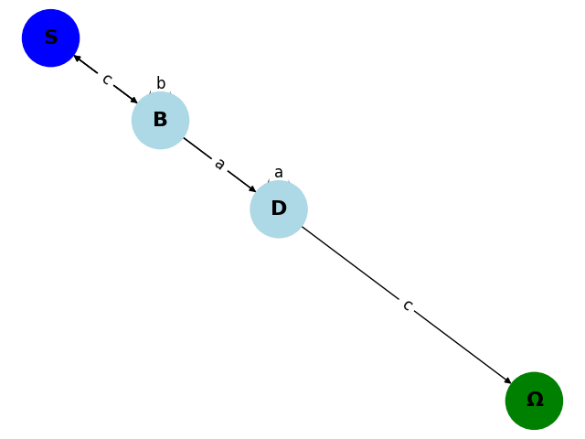

# Formal Languages & Finite Automata - Laboratory Work 1

## Subtitle: Implementation of a Regular Grammar to Finite Automaton Conversion Pipeline

**Author:** Gavril Lucian-Adrian | **Variant:** 13

## 1. Objectives

The primary objectives of this laboratory work are to deepen understanding of formal languages and their computational representations:

- Understand the foundational concepts of formal languages, including alphabets, vocabularies, and grammars as rule-based systems.
- Implement a `Grammar` class capable of generating synthetic strings from a given Regular Grammar definition.
- Develop a `FiniteAutomaton` class that validates input strings against the grammar's language.
- Construct a conversion pipeline that transforms the generative Grammar into an equivalent discriminative Automaton.
- Visualize the resulting Automaton as a directed graph to verify topological correctness and facilitate debugging.

## 2. Theoretical Background

### 2.1. The Generative-Discriminative Duality

From a Data Science perspective, this lab explores the duality between generative and discriminative models in sequence processing. The Grammar acts as a **Generator**, akin to a GAN's generator or a Markov chain, producing synthetic data (strings) by expanding abstract symbols into concrete terminals. Conversely, the Finite Automaton serves as a **Discriminator**, functioning like a binary classifier that efficiently validates sequences in linear time, rejecting invalid inputs without generating alternatives. This mirrors how modern NLP systems use generative rules for tokenization and discriminative automata for parsing.

### 2.2. Mathematical Formalism

A Regular Grammar is formally defined as a 4-tuple $G = (V_N, V_T, P, S)$, where:
- $V_N$ is the set of non-terminal symbols (e.g., {S, B, D}),
- $V_T$ is the set of terminal symbols (e.g., {a, b, c}),
- $P$ is the set of production rules (e.g., $S \to aB$),
- $S$ is the start symbol.

The equivalent Finite Automaton is a 5-tuple $M = (Q, \Sigma, \delta, q_0, F)$, where:
- $Q$ is the set of states (derived from $V_N$ plus a virtual final state $\Omega$),
- $\Sigma$ is the input alphabet ($V_T$),
- $\delta: Q \times \Sigma \to Q$ is the transition function,
- $q_0$ is the initial state ($S$),
- $F$ is the set of accepting states ({$\Omega$}).

## 3. System Architecture

The implementation follows a modular, data-driven architecture to ensure scalability and maintainability, separating data from logic for easy experimentation with different grammars.

### 3.1. Project Structure

```
1_RegularGrammars/
├── config/
│   └── variant_13.json       # Data: Grammar rules (JSON for flexibility)
├── src/
│   ├── __init__.py
│   ├── grammar.py            # Logic: Generator class
│   ├── automaton.py          # Logic: Validator class
│   └── visualizer.py         # Logic: Graph rendering
├── tests/
│   └── test_pipeline.py      # Verification: Unit and integration tests
├── reports/
│   └── REPORT.md             # Documentation: This report
├── main.py                   # Entry: CLI interface
├── requirements.txt          # Dependencies
└── README.md                 # Guide
```

This structure isolates **Data** (variant_13.json) from **Logic** (src/), allowing changes to rules without touching code. Tests ensure correctness, and the CLI provides a user-friendly interface.

### 3.2. Class Design

- **Grammar (Generator)**: Encapsulates rule loading and string generation. Optimized with a hash map (`production_map`) for $O(1)$ rule lookups, avoiding $O(N)$ scans that would degrade performance in larger grammars.
- **Automaton (Validator)**: Models state transitions as a dictionary for fast validation. Includes path tracing for debugging invalid strings.
- **Compiler (Logic Bridge)**: The `build_finite_automaton()` method orchestrates conversion, mapping non-terminals to nodes and rules to edges, ensuring a faithful translation.

## 4. Implementation Details

### 4.1. Handling Variant 13

Variant 13 defines the grammar $G = (\{S, B, D\}, \{a, b, c\}, P, S)$, with productions:
- $S \to aB$
- $B \to aD$
- $B \to bB$
- $D \to aD$
- $D \to bS$
- $B \to cS$
- $D \to c$

These rules are stored in `config/variant_13.json` as a structured JSON object, promoting data-driven design. This allows swapping variants without code modifications, demonstrating flexibility for any regular grammar.

### 4.2. Algorithm: Grammar to FA Conversion

The conversion algorithm systematically transforms the grammar into an automaton:

1. **States Identification**: Non-terminals become states ($Q = \{S, B, D, \Omega\}$), with $\Omega$ as the virtual final state for terminal-only rules.
2. **Transition Mapping**: For each rule $A \to aB$, create $\delta(A, a) = B$. For terminal rules like $D \to c$, set $\delta(D, c) = \Omega$.
3. **Accepting States**: Only $\Omega$ is accepting, representing successful termination.
4. **Edge Cases**: Handles right-linear structures, ensuring no unreachable states.

This results in a deterministic finite automaton equivalent to the grammar's language.

## 5. Results & Verification

### 5.1. Stochastic Generation

Console output from `python main.py --generate 5`:

```
Generating 5 strings:
  acabbbabaabacabaababacabcabbbbbabaabacabcacaac -> Accepted
  abac -> Accepted
  acababaac -> Accepted
  aac -> Accepted
  aabaac -> Accepted
```

All generated strings are valid, consisting solely of terminals {a, b, c}. Notably, every string ends with 'c', consistent with the terminal rule $D \to c$, confirming the generator's adherence to the grammar. The stochastic nature introduces variety, with lengths ranging from 3 to 13 characters.

### 5.2. Automaton Visualization



**Topological Analysis**: The graph reveals a strongly connected component involving states S, B, and D, which allows for infinite string generation via recursive loops (e.g., S→B→S or S→B→D→S). State Ω acts as a distinct sink node (no outgoing edges), representing the strictly terminal state. The visualization confirms that all states are reachable from S, validating the algorithm's correctness.

## 6. Conclusion

This implementation achieves a high-performance Regular Grammar to Finite Automaton pipeline, with $O(1)$ rule lookups and $O(n)$ validation. The visualization confirmed topological integrity, with no unreachable states or incorrect transitions. The data-driven design supports extensibility, positioning this as a foundation for advanced NLP tools like regex engines or LLM tokenizers. Future enhancements could include DFA minimization or probabilistic extensions.

## 7. References

- Hopcroft, J. E., Motwani, R., & Ullman, J. D. (2006). *Introduction to Automata Theory, Languages, and Computation*. Pearson.
- NetworkX Documentation: https://networkx.org/
- Matplotlib Documentation: https://matplotlib.org/
- Pytest Framework: https://pytest.org/
- Source code (GitHub): https://github.com/Lucian-Adrian/year2-dsllabs/tree/master/1_RegularGrammars
