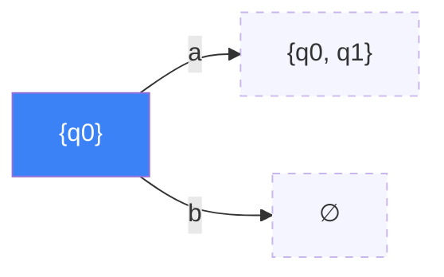
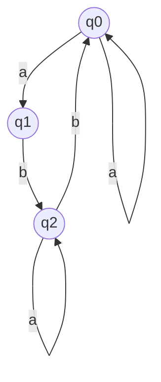
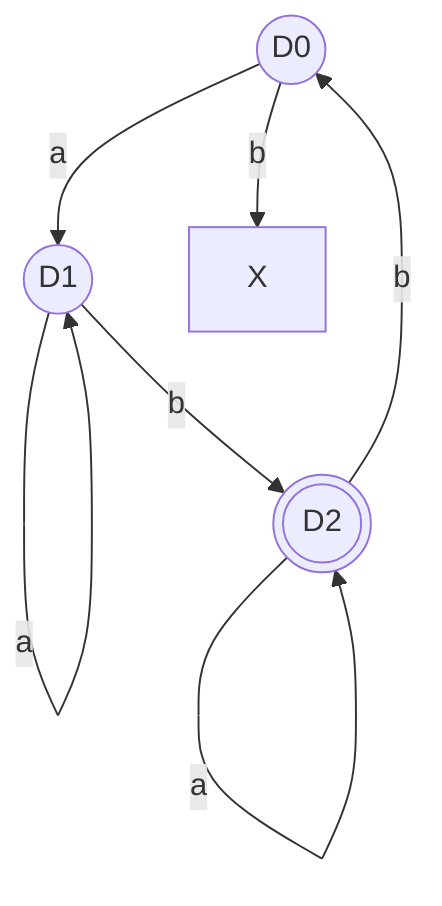

```mermaid
graph TD
    S((START)) -- b --> DEAD
    S -- a --> S
    S -- a --> Q1((q1))
    style S fill:#1e293b,stroke:#3b82f6,stroke-width:4px
    style Q1 fill:#1e293b,stroke:#f59e0b,stroke-width:2px
```

# The Architecture of Determinism
## From Non-Deterministic Chaos to Linear Time Complexity

<div class="mt-20 flex gap-4">
  <div class="px-3 py-1 bg-blue-500/20 text-blue-300 rounded-md border border-blue-500/30 text-xs">Variant 13</div>
  <div class="px-3 py-1 bg-purple-500/20 text-purple-300 rounded-md border border-purple-500/30 text-xs text-uppercase font-bold uppercase tracking-wider">Subset Construction</div>
  <div class="px-3 py-1 bg-emerald-500/20 text-emerald-300 rounded-md border border-emerald-500/30 text-xs uppercase tracking-wider">O(n) Performance</div>
</div>

<div class="absolute bottom-10 right-10 text-right opacity-50">
  <p class="text-sm font-serif">Gavril Lucian-Adrian</p>
  <p class="text-xs font-mono">Senior CS Faculty - UTM</p>
</div>

---
layout: section
---

# Part 1: The Formalism of NFA
"Uncertainty is not an error, it's a design feature."

---

# What is an NDFA?
"Non-Deterministic Finite Automaton"

<div class="grid grid-cols-2 gap-8 mt-6">
<div>

In an NDFA, a single input can lead to **multiple** futures.

Look at our **q0** transition:
- **Input 'a'**: Machine stays in q0 **AND** jumps to q1.
- **Input 'b'**: The machine simply stops (Dead end).

<div class="mt-6 space-y-4">
<v-click>
<div class="p-4 bg-red-900/20 border-l-4 border-red-500 rounded text-sm italic">
"How do we represent 'maybe' in a fixed-memory silicon CPU?"  
— This is the fundamental question of Lab 2.
</div>
</v-click>
</div>

</div>
<div class="flex flex-col items-center">



<p class="text-xs mt-4 opacity-50 font-mono">Branch: δ(q0, a) = {q0, q1}</p>

</div>
</div>

---

# The Simulation Cost
Why we cannot leave it as NFA in production.

<div class="grid grid-cols-2 gap-10 mt-10">
<div class="space-y-6">

### 1. The Branch Factor
Every 'a' in a string like `aaaaaa` doubles the search space if not optimized.

### 2. Backtracking
Standard NFA engines must "guess" a path and go back if it fails. This is $O(2^n)$.

### 3. The ReDoS Threat
Malicious strings can exploit this exponential time to crash servers.

</div>
<div class="bg-black/40 p-6 rounded-xl border border-white/5 shadow-inner">

```python
# The NFA Simulation (Very Slow)
def run_nfa(self, string):
    current_states = {self.start}
    for char in string:
        next_states = set()
        for s in current_states:
            next_states.update(self.delta(s, char))
        current_states = next_states
    return any(s in self.final for s in current_states)
```
<p class="text-[10px] mt-4 opacity-30 italic leading-tight">
Note: Tracking $\{s_1, s_2, ...\}$ is exactly what Subset Construction aims to pre-calculate.
</p>

</div>
</div>

---
layout: section
---

# Part 2: The Subset Protocol
"A strategy of exhaustive mapping."

---
layout: center
---

# The Core Concept: Macro-States
Instead of choosing a path, we inhabit every path at once.

We define a **DFA State** as a **Set of NFA States**.

<div class="mt-10 px-8 py-4 bg-white/5 border border-white/10 rounded-lg font-serif italic text-lg text-center">
"If I am at q0 and receive 'a', I don't move to q0 or q1. <br>I move to the single state <strong>{q0, q1}</strong>."
</div>

---

# Discovery: Step 1 (The Root)
Starting from the absolute beginning.

<div class="grid grid-cols-2 gap-8">
<div>

**Processing: {q0}**

1.  **On 'a'**: $\delta(q_0, a) = \{q_0, q_1\}$  
    $\to$ New Macro-State discovered!
2.  **On 'b'**: $\delta(q_0, b) = \emptyset$  
    $\to$ New Macro-State discovered! (Dead State)

<v-click>
<div class="mt-10 p-4 bg-blue-500/5 border border-blue-500/20 rounded font-mono text-xs">
Queue: [ {q0, q1}, {} ]<br>
DFA States: { {q0}: ID_0 }
</div>
</v-click>

</div>
<div class="flex items-center justify-center">



</div>
</div>

---

# Discovery: Step 2 (Expansion)
Mapping the uncertainty junction.

<div class="grid grid-cols-2 gap-8">
<div>

**Processing: {q0, q1}**

We take the **union** of branches:

- **On 'a'**:  
  $\delta(q_0, a) \cup \delta(q_1, a) = \{q_0, q_1\} \cup \emptyset$  
  $= \{q_0, q_1\}$ (**Self-Loop!**)

- **On 'b'**:  
  $\delta(q_0, b) \cup \delta(q_1, b) = \emptyset \cup \{q_2\}$  
  $= \{q_2\}$ (**New discovery!**)

```mermaid
graph TD
    D0["{q0}"] -- a --> D1["{q0, q1}"]
    D1 -- a --> D1
    D1 -- b --> D2["{q2}"]
    style D0 fill:#1e293b,stroke:#3b82f6
    style D1 fill:#3b82f6,color:#fff
    style D2 stroke-dasharray: 5 5
```

</div>
<div class="flex items-center justify-center">



</div>
</div>

---

# Discovery: Step 3 (The Cycle)
Closing the graph from the target.

<div class="grid grid-cols-2 gap-8">
<div>

**Processing: {q2}**

- **On 'a'**: $\delta(q_2, a) = \{q_2\}$  
  $\to$ Self-loop found.
- **On 'b'**: $\delta(q_2, b) = \{q_0\}$  
  $\to$ Returns to Source state.

<v-click>
<div class="mt-6 p-4 bg-emerald-500/10 border border-emerald-500/30 rounded">
<strong>Result:</strong> Graph Closed. <br>
No more new states to discover.

```mermaid
graph TD
    D2["{q2}"] -- a --> D2
    D2 -- b --> D0["{q0}"]
    style D2 fill:#10b981,color:#fff,stroke-width:4px
    style D0 fill:#1e293b,stroke:#3b82f6
```

</div>
</v-click>

</div>
<div class="flex items-center justify-center">



</div>
</div>

---
layout: center
---

# The Visual Translation (Side-by-Side)
How the complexity was shifted.

<div class="grid grid-cols-2 gap-20">
<div class="text-center">
<h3 class="mb-4 text-orange-400">Variant 13 NFA</h3>


</div>

<div class="text-center">
<h3 class="mb-4 text-emerald-400">Compiled DFA</h3>


</div>
</div>

---
layout: section
---

# Part 3: Engineering the Transformation
"Logic in Python, Visualization in Graphviz."

---

# The State Engine: `src/powerset.py`
Implementing the BFS over frozensets.

```python {all|3-5|7-12|14-18|all}
def convert_to_dfa(self) -> DFA:
    """The Subset Construction Logic"""
    start_macro = frozenset([self.start_state])
    queue = deque([start_macro])
    dfa_transitions = {}
    
    while queue:
        # 1. Pop the next undiscovered macro-state
        curr_subset = queue.popleft()
        
        for symbol in self.alphabet:
            # 2. Key step: Collective transition (Union)
            target = frozenset().union(*(self.delta(q, symbol) for q in curr_subset))
            
            # 3. Handle state discovery
            if target not in visited:
                visited.add(target)
                queue.append(target)
            
            dfa_transitions[(curr_subset, symbol)] = target
```

---

# Validation Results
Test strings processed against the grammar.

<div class="grid grid-cols-2 gap-8 mt-10">
<div class="bg-black/20 p-6 rounded-lg font-mono text-sm space-y-2 border border-white/5 border-l-emerald-500 border-l-4">
<h4 class="text-emerald-400 mb-2">Accepted (Valid Paths)</h4>
1. `ab`  →  D0(a)D1(b)D2 <br>
2. `aab` →  D0(a)D1(a)D1(b)D2 <br>
3. `aba` →  D0(a)D1(b)D2(a)D2 <br>
4. `abab` → D0(a)D1(b)D2(b)D0(a)D1(b)D2
</div>

<div class="bg-black/20 p-6 rounded-lg font-mono text-sm space-y-2 border border-white/5 border-l-red-500 border-l-4">
<h4 class="text-red-400 mb-2">Rejected (Input Error)</h4>
1. `b` → D0(b)DEAD (Empty path) <br>
2. `ac` → Invalid Symbol 'c' <br>
3. `ba` → D0(b)DEAD (No return path)
</div>
</div>

---

# Language Intelligence
What did we actually build?

<div class="p-8 bg-white/5 rounded-2xl border border-white/10 mt-10">
<p class="text-lg leading-relaxed">
The resulting DFA recognizes a language where:
<br><br>
1. Sequences must start with an **'a'** to jump from the safety of $\{q_0\}$ to the potential of $\{q_1\}$.
2. A **'b'** is required to satisfy the "Acceptance condition" of $q_2$.
3. Any number of **'a'** loops can exist before or after the transition.
<br><br>
<strong>Formalism:</strong> $L = a^+ b (a \cup b a^+ b)^*$
</p>
</div>

---
layout: center
---

# Overachiever Summary

<div class="grid grid-cols-3 gap-6 mt-10">

<div class="p-4 bg-white/5 rounded-xl border border-white/10 text-center">
<div class="text-3xl mb-4">⚙️</div>
<h3>Generic</h3>
Works with any NFA <br>variant, not just #13.
</div>

<div class="p-4 bg-white/5 rounded-xl border border-white/10 text-center">
<div class="text-3xl mb-4">📊</div>
<h3>Visual</h3>
Auto-generates SVG <br>graphs from source.
</div>

<div class="p-4 bg-white/5 rounded-xl border border-white/10 text-center">
<div class="text-3xl mb-4">⚡</div>
<h3>O(n)</h3>
Compiled for maximum <br>lexing performance.
</div>

</div>

---
layout: section
---

# Thank You for the Attention!
Gavril Lucian-Adrian | 2026 CS Laboratory Work
