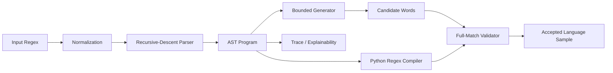

# Lab 4 - Mission-Grade Dynamic Regex Generator

## Context
Course: Formal Languages and Finite Automata

This is not a one-off solution for one handwritten formula. This is a reusable regex engine for all 4 lab variants, with explainability, safety bounds, verification, and visual mission artifacts.

## Mission Statement
Build a dynamic system that can:
- parse regex expressions into a formal AST,
- generate valid language samples,
- explain each generation path,
- validate outputs independently,
- and export visual diagrams suitable for presentation/demo.

## What Is Delivered
- Full variant coverage (all expressions in variants 1-4).
- Recursive-descent parser with precedence and superscript normalization.
- Deterministic and random generation modes.
- Hard safety bounds for infinite operators (`*`, `+`) via cap (default 5).
- Bonus trace output for generation process.
- Mermaid export for AST, pipeline, and trace visuals.
- Automated tests that verify parsing, examples, generation validity, and visuals.

## System Architecture



Core modules:
- `src/parser.py`: regex parser + normalization.
- `src/ast_nodes.py`: formal node model (`Literal`, `Concat`, `Alternation`, `Repeat`).
- `src/generator.py`: language generation + trace + Python regex emitter.
- `src/visualization.py`: Mermaid diagram builders and AST metrics.
- `src/variants.py`: canonicalized assignment variants and official examples.
- `main.py`: CLI orchestration and visual exports.

## Why This Is "Overachiever"
- Dynamic engine, no per-expression hardcoded output scripts.
- Independent validator (AST-to-Python-regex full match).
- Mission-style diagnostics (`--mission-brief`) with complexity proxies.
- Visual export pipeline for AST/trace communication.

## ML Analogy (Accurate, Useful)
This project is analogous to constrained decoding in modern sequence models:
- Regex AST is the constraint program.
- Alternation is branching over valid token trajectories.
- Repetition bounds are decoding-time regularization that prevents path explosion.
- Validation stage acts like post-decoding hard constraint checking.

Practical connection:
- In LLM systems, constrained decoding forces outputs to satisfy schemas/phrases.
- Here, generation is constrained by formal language rules and checked with full-match.

## Real-World Use Cases
- Safe synthetic test-data generation for parsers and protocol validators.
- Fuzzing lexical pipelines with guaranteed-valid seeds.
- Input guardrail testing (e.g., form, telemetry, ETL token patterns).
- Classroom demonstrations of symbolic constraints vs probabilistic generation.

## Usage

From repository root:

```powershell
python 4_regular_expressions/main.py --variant all --samples 8 --validate
python 4_regular_expressions/main.py --variant 3 --samples 12 --show-steps --validate --mission-brief
python 4_regular_expressions/main.py --regex "A(B|C)+D?" --samples 10 --show-steps
```

Generate visual artifacts:

```powershell
python 4_regular_expressions/main.py --variant all --samples 6 --show-steps --export-mermaid-dir 4_regular_expressions/reports/visuals
```

Key flags:
- `--max-repeat`: cap for unbounded repetition.
- `--show-steps`: detailed generation trace.
- `--validate`: full-match verification.
- `--mission-brief`: deep diagnostics + ML-style interpretation.
- `--export-mermaid-dir`: writes `.mmd` visuals (AST, pipeline, trace).

## Testing

```powershell
python -m pytest 4_regular_expressions/tests -q
```

## Technical Depth Notes
Let:
- `N` = AST node count,
- `B` = branching factor from alternations,
- `R` = repeat cap.

Worst-case generation complexity is combinatorial in `B` and `R`. This is expected for language enumeration. The implementation keeps it tractable by:
- capping unbounded repeats,
- capping output volume (`max_results`),
- deduplicating generated strings.

## Additional Report
For presentation-grade narrative and richer analogy/visual framing, see:
- `reports/REPORT.md`
- `reports/MISSION_BRIEF.md`
