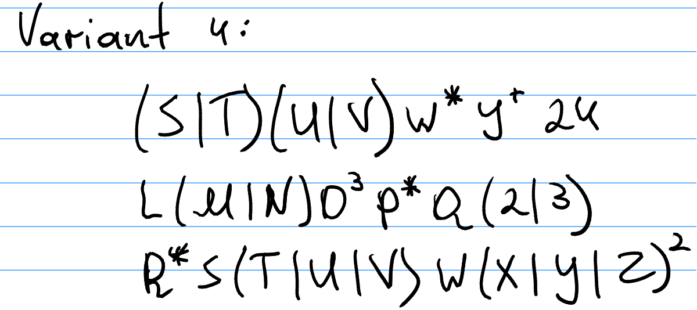
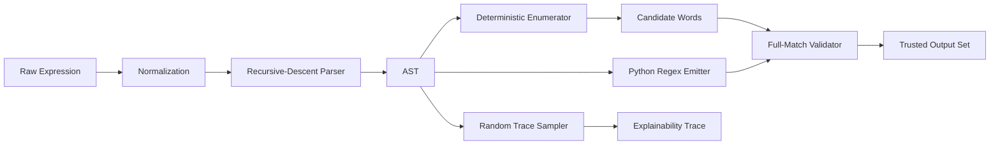
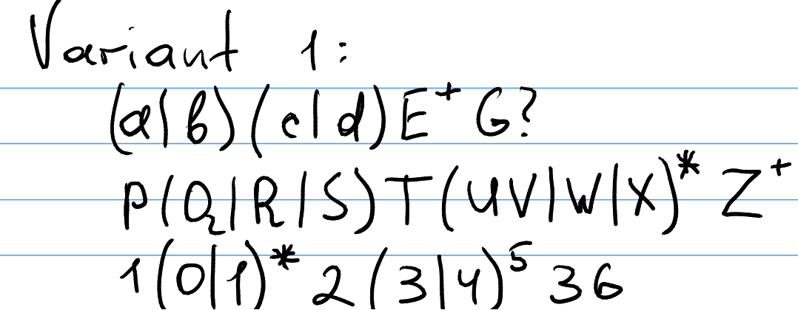
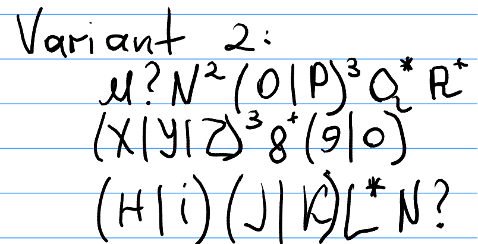
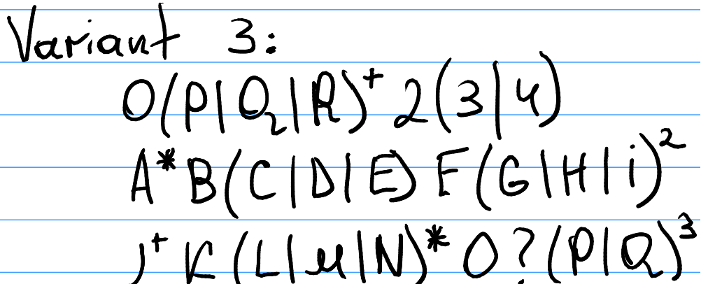

Formal Languages · Lab 4 · Universal Engine

# Mission-Grade Dynamic Regex Generator
## One parser, one AST, one bounded generator, four assignment variants

Instead of hardcoding strings for one handwritten exercise, this lab builds a <strong>general regex interpretation engine</strong> that parses, generates, validates, and explains regular expressions dynamically.

  

    
4

    
Variants Covered

  

  

    
12

    
Expressions Interpreted

  

  

    
12

    
Tests Passing

  

  

    
5x

    
Repeat Safety Cap

  

Presentation Mode · Mission Console

<!--
Open with the big promise: this is not a one-off solution, it is a reusable engine.
Point to the four metrics as the headline proof.
-->

---
layout: section
---

# Why This Lab Exists

Regular expressions are compact symbolic programs. The real challenge is not reading them. The real challenge is making a computer <strong>interpret them safely and dynamically</strong>.

<!--
Frame the lab as interpretation of a symbolic language, not just random string printing.
-->

---

# Assignment Reality Check

  

    
What the brief requires

    

      
<strong>Generate valid words dynamically</strong>, not by hardcoding outputs.

      
Handle operators like <code>*</code>, <code>+</code>, <code>?</code>, powers, and alternation.

      
Cap infinite repetition at <strong>5</strong> to avoid runaway generation.

      
Bonus: show the <strong>sequence of processing</strong>.

      
Present the system, the algorithm, and the faced difficulties.

    

  

  

    
  

<!--
Show that the assignment itself pushes toward a dynamic interpreter.
Mention that all four handwritten variants were normalized into machine-readable expressions.
-->

---

# The Wrong Approach vs The Correct Approach

  

    
Wrong

    <h3 class="mt-2">Hardcode each case</h3>
    <ul class="mt-4">
      <li>Manually branch per variant</li>
      <li>Manually craft string templates</li>
      <li>Lose generality immediately</li>
      <li>Cannot explain parsing formally</li>
      <li>Looks like output imitation, not language processing</li>
    </ul>
  

  

    
Correct

    <h3 class="mt-2">Build one universal engine</h3>
    <ul class="mt-4">
      <li>Parse symbolic input into an AST</li>
      <li>Generate words from structure</li>
      <li>Validate with an independent regex backend</li>
      <li>Export traces and diagrams</li>
      <li>Reuse the same pipeline for every variant</li>
    </ul>
  

The core academic value of this submission is that the algorithm works on the language description itself, not on one memorized answer pattern.

<!--
This slide is where you defend the engineering direction.
If asked why your solution is better, point to universality and explainability.
-->

---

# Explain It Like I’m Five

Regular expression means:

- `A|B`: pick one door.
- `AB`: do this, then this.
- `A*`: repeat this zero or more times.
- `A+`: repeat this one or more times.
- `A^3`: repeat this exactly three times.

<pre class="code-shell mt-6 mono dense-small">Expression: (S|T)(U|V)W*Y+24

1. choose S or T
2. choose U or V
3. add zero or more W
4. add one or more Y
5. finish with 24</pre>

<!--
Use this slide to make the audience comfortable.
Once they understand the recipe metaphor, the AST becomes easy to sell.
-->

---

# Formal Model of the Engine

<table>
  <thead>
    <tr>
      <th>Symbolic concept</th>
      <th>Engine representation</th>
      <th>Operational role</th>
    </tr>
  </thead>
  <tbody>
    <tr><td>Literal</td><td><code>Literal("A")</code></td><td>Emits a concrete symbol</td></tr>
    <tr><td>Concatenation</td><td><code>Concat(parts)</code></td><td>Sequential composition</td></tr>
    <tr><td>Alternation</td><td><code>Alternation(options)</code></td><td>Branch selection</td></tr>
    <tr><td>Repetition</td><td><code>Repeat(node, min, max)</code></td><td>Bounded expansion</td></tr>
    <tr><td>Whole regex</td><td><code>RegexNode</code> tree</td><td>Program to interpret</td></tr>
  </tbody>
</table>

In other words, the regex is first converted from raw text into a structured intermediate representation, exactly like a miniature compiler pipeline.

<!--
This is the bridge from intuition to theory.
Say: "we move from syntax to structure before generating anything."
-->

---

# End-to-End Architecture

Parse → Generate → Validate → Explain

<!--
This is the main systems slide.
Walk left to right slowly and make the audience feel the pipeline.
-->

---

# Stage 1 - Normalization

  

    
Why normalization matters

    <ul class="mt-4">
      <li>Assignment notation is handwritten and sometimes ambiguous.</li>
      <li>Whitespace is irrelevant for parsing.</li>
      <li>Unicode superscripts like <code>²</code> and <code>⁵</code> must become machine-friendly.</li>
    </ul>
  

  

<pre class="code-shell mono dense-small">def normalize_expression(expression: str) -&gt; str:
    # remove whitespace
    # convert A² into A^2
    # preserve explicit structure</pre>

Example: <code>(A|B)²C⁵</code> becomes <code>(A|B)^2C^5</code>

  

<!--
Emphasize that this is not changing the meaning, only standardizing the notation.
-->

---

# Stage 2 - Recursive-Descent Parsing

  
Operator precedence

  

    

      
1

      
Repetition

    

    

      
2

      
Concatenation

    

    

      
3

      
Alternation

    

  

The parser does not generate strings directly. It first discovers the grammar structure hidden inside the text.

<!--
Explain precedence carefully: repetition binds tighter than concatenation, concatenation tighter than union.
-->

---

# Parser Strategy in Code

<pre class="code-shell mt-6 mono dense-small">def _parse_union(self) -&gt; RegexNode:
    options = [self._parse_concat()]
    while self._peek() == "|":
        self._consume("|")
        options.append(self._parse_concat())
    return options[0] if len(options) == 1 else Alternation(tuple(options))

def _parse_concat(self) -&gt; RegexNode:
    parts = []
    while True:
        token = self._peek()
        if token is None or token in ")|":
            break
        parts.append(self._parse_repetition())</pre>

<!--
Point out that each function corresponds to one grammar level.
This is classic recursive-descent design.
-->

---

# AST Example

  

    
Input expression

    <h3 class="mt-2 mono">(S|T)(U|V)W*Y+24</h3>
    

      
<strong>Concat</strong> is the top-level spine.

      
Inside it we have two <strong>Alternation</strong> nodes.

      
<code>W*</code> becomes <strong>Repeat(min=0,max=∞)</strong>.

      
<code>Y+</code> becomes <strong>Repeat(min=1,max=∞)</strong>.

      
The terminal suffix <code>24</code> remains literal sequence.

    

  

  

    <Mermaid :value="`flowchart TD
  ROOT([Regex Root]) --> C[Concat]
  C --> A1[Alternation S or T]
  C --> A2[Alternation U or V]
  C --> R1[Repeat W 0..inf]
  C --> R2[Repeat Y 1..inf]
  C --> L2[Literal 2]
  C --> L4[Literal 4]`" />
  

<!--
Keep it concrete: the AST is simply the recipe written as a tree.
-->

---

# Stage 3 - Deterministic Enumeration

  
Goal

  Produce many valid strings without duplicates, while respecting finite output limits.

  

    

      
Unique

      
Deduplicate outputs

    

    

      
Bounded

      
Cap repeats at 5 when infinite

    

    

      
Controlled

      
Stop at max_results

    

  

<!--
Explain that enumeration is the safe academic mode: systematic, bounded, inspectable.
-->

---

# Why the Repeat Cap Matters

  

    
Without cap

    <h3 class="mt-2">The search space can explode</h3>
    
Operators like <code>*</code> and <code>+</code> describe infinite languages.

    
The lab rule says: stop after 5 repetitions to keep generation finite and presentation-friendly.

  

  

<pre class="code-shell mono dense-small">A*  ->  "", A, AA, AAA, AAAA, AAAAA
A+  ->  A, AA, AAA, AAAA, AAAAA</pre>

This is a correctness-preserving operational constraint for the assignment, not a change to regex semantics in general.

  

<!--
This slide is important for viva questions about infinite languages.
Say: "we approximate generation, not parsing semantics."
-->

---

# Stage 4 - Random Trace Sampling

  

    
Bonus point feature

    <h3 class="mt-2">Explain what happened, step by step</h3>
    <ul class="mt-4">
      <li>which alternative was chosen,</li>
      <li>how many times repetition expanded,</li>
      <li>which literals were emitted,</li>
      <li>and in what order the tree was traversed.</li>
    </ul>
  

  

    <Mermaid :value="`flowchart LR
  S([seeded decode]) --> A[choose T]
  A --> B[choose U]
  B --> C[repeat W x4]
  C --> D[repeat Y x5]
  D --> E[emit 2]
  E --> F[emit 4]
  F --> O([TUWWWWYYYYY24])`" />
  

<!--
This is the easiest slide for demonstrating the bonus requirement.
-->

---

# Stage 5 - Independent Validation

  
Trust, then verify

  <h3 class="mt-2">Generated strings are checked with Python’s regex engine</h3>
  <pre class="code-shell mono dense-small">compiled = re.compile(f"^{to_python_regex(ast)}$")
invalid = [word for word in words if compiled.fullmatch(word) is None]</pre>
  

The generator and the validator are intentionally separate. That gives us a second line of evidence that the emitted words really match the intended expression.
  

<!--
Use the phrase "independent validator" because professors like separation of concerns.
-->

---
layout: section
---

# Universal Variant Coverage

The strongest part of the submission is that <strong>every variant is analyzed by the same engine</strong>. No variant-specific hardcoding is required.

<!--
Transition from architecture into evidence across all variants.
-->

---

# All Four Variants at a Glance

  

    <h3>Variant 1</h3>
    
  

  

    <h3>Variant 2</h3>
    
  

  

    <h3>Variant 3</h3>
    
  

  

    <h3>Variant 4</h3>
    
  

<!--
Pause here and remind them that the code must interpret all four, not just one.
-->

---

# Variant Map After Interpretation

<table>
  <thead>
    <tr>
      <th>Variant</th>
      <th>Expression 1</th>
      <th>Expression 2</th>
      <th>Expression 3</th>
    </tr>
  </thead>
  <tbody>
    <tr><td>1</td><td><code>(a|b)(c|d)E+G?</code></td><td><code>P(Q|R|S)T(UV|W|X)*Z+</code></td><td><code>1(0|1)*2(3|4)^5(3)(6)</code></td></tr>
    <tr><td>2</td><td><code>M?N^2(O|P)^3Q*R+</code></td><td><code>(X|Y|Z)^3(8)+(9|0)</code></td><td><code>(H|I)(J|K)L*N?</code></td></tr>
    <tr><td>3</td><td><code>O(P|Q|R)+2(3|4)</code></td><td><code>A*B(C|D|E)F(G|H|I)^2</code></td><td><code>J+K(L|M|N)*O?(P|Q)^3</code></td></tr>
    <tr><td>4</td><td><code>(S|T)(U|V)W*Y+24</code></td><td><code>L(M|N)O^3P*Q(2|3)</code></td><td><code>R*S(T|U|V)W(X|Y|Z)^2</code></td></tr>
  </tbody>
</table>

<!--
This slide proves the handwritten forms were made explicit and machine-readable.
-->

---

# Variant 1 - Mixed Optionality and Fixed Suffixes

  

    
 Variant 1

    <ul class="mt-4">
      <li>Alternation at the front: choose symbol families early.</li>
      <li>Open repetition with <code>E+</code>.</li>
      <li>Optional suffix with <code>G?</code>.</li>
      <li>Numeric example with exact power <code>(3|4)^5</code>.</li>
    </ul>
  

  

    
Representative outputs

    
acE, acEG, acEE, acEEG, acEEE, acEEEG

    
Complexity snapshot

    
Expression 2 has roughly <strong>5460</strong> bounded paths.

  

<!--
Use this slide to show that different operator patterns stress different parts of the engine.
-->

---

# Variant 2 - Exact Counts and Compact Branching

  

    
 Variant 2

    <ul class="mt-4">
      <li><code>N^2</code> and <code>(O|P)^3</code> test exact bounded repetition.</li>
      <li><code>Q*</code> and <code>R+</code> combine optional and mandatory growth.</li>
      <li>The second expression creates a tight alphanumeric pattern.</li>
    </ul>
  

  

    
Representative outputs

    
NNOOOR, NNOOORR, NNOOORRR, XXX89, XXX80, HJLLN

    
Complexity snapshot

    
Variant 2 is moderate and controlled, topping out at <strong>480</strong> bounded paths for expression 1.

  

<!--
Mention that exact powers are easier to reason about than star-heavy expressions.
-->

---

# Variant 3 - The Hardest Search Space

  

    
 Variant 3

    <ul class="mt-4">
      <li><code>J+K(L|M|N)*O?(P|Q)^3</code> is the densest expression.</li>
      <li>It mixes mandatory repetition, optional segments, and branching.</li>
      <li>This is where the bounded strategy matters most.</li>
    </ul>
  

  

    
29120

    
Rough bounded paths for Variant 3, Expression 3

    
JKPPP, JKPPQ, JKPQP, JKPQQ, JKQPP, JKQPQ

  

<!--
Call this the "stress test" variant.
-->

---

# Variant 4 - Presentation-Friendly Structure

  

    
 Variant 4

    <ul class="mt-4">
      <li>Very clear left-to-right structure.</li>
      <li>Good for live demos because the final suffixes are visually obvious.</li>
      <li>Useful as the main walkthrough expression in presentations.</li>
    </ul>
  

  

    
Representative outputs

    
SUY24, SUYY24, SUWY24, LMOOOQ2, LMOOOPQ3, STWXX

    
Mission note

    
Variant 4 is visually clean, but the system remains universal across all four variants.

  

<!--
Use this slide to explain why Variant 4 is nice for live explanation even though the engine is universal.
-->

---

# Cross-Variant Metrics

<table>
  <thead>
    <tr>
      <th>Variant.Expr</th>
      <th>Nodes</th>
      <th>Depth</th>
      <th>Alternations</th>
      <th>Repeats</th>
      <th>Rough paths</th>
    </tr>
  </thead>
  <tbody>
    <tr><td>V1.E1</td><td>11</td><td>3</td><td>2</td><td>2</td><td>40</td></tr>
    <tr><td>V1.E2</td><td>16</td><td>5</td><td>2</td><td>2</td><td>5460</td></tr>
    <tr><td>V1.E3</td><td>13</td><td>4</td><td>2</td><td>2</td><td>2016</td></tr>
    <tr><td>V2.E1</td><td>13</td><td>4</td><td>1</td><td>5</td><td>480</td></tr>
    <tr><td>V2.E2</td><td>11</td><td>4</td><td>2</td><td>2</td><td>270</td></tr>
    <tr><td>V2.E3</td><td>11</td><td>3</td><td>2</td><td>2</td><td>48</td></tr>
    <tr><td>V3.E1</td><td>11</td><td>4</td><td>2</td><td>1</td><td>726</td></tr>
    <tr><td>V3.E2</td><td>14</td><td>4</td><td>2</td><td>2</td><td>162</td></tr>
    <tr><td>V3.E3</td><td>15</td><td>4</td><td>2</td><td>4</td><td>29120</td></tr>
    <tr><td>V4.E1</td><td>13</td><td>3</td><td>2</td><td>2</td><td>120</td></tr>
    <tr><td>V4.E2</td><td>13</td><td>3</td><td>2</td><td>2</td><td>24</td></tr>
    <tr><td>V4.E3</td><td>14</td><td>4</td><td>2</td><td>2</td><td>162</td></tr>
  </tbody>
</table>

<!--
This slide is strong evidence of analysis depth.
If time is short, only mention the outlier: V3.E3.
-->

---

# Why Complexity Grows Fast

  
Combinatorics, not magic

  

    Let <strong>N</strong> be node count, <strong>B</strong> the branching factor from alternation, and <strong>R</strong> the repeat cap.
    Then bounded enumeration can still grow combinatorially.
  

  

    Alternation multiplies choices. Repetition multiplies those choices again. The cap keeps that explosion operationally manageable.
  

This is exactly why the lab explicitly asks for a limit of 5 when repetition is otherwise unbounded.

<!--
The point is to show that the generator is not naive; it is controlled by design.
-->

---

# Verification Strategy

  

    
Test suite

    <ul class="mt-4">
      <li>all variant patterns parse,</li>
      <li>official sample strings match,</li>
      <li>generated strings pass independent validation,</li>
      <li>repeat limits are respected,</li>
      <li>trace and Mermaid outputs are non-empty.</li>
    </ul>
  

  

    <pre class="code-shell mono dense-small">def test_generated_words_match_python_regex_engine() -&gt; None:
    for variant in VARIANTS.values():
        for expression in variant.expressions:
            node = parse_regex(expression)
            pattern = _compiled(expression)
            generated = generate_language(node, max_repeat=5, max_results=30)</pre>
  

<!--
This slide makes the work feel trustworthy and disciplined.
-->

---

# Correctness Contract

  

    
Claim 1

    <h3>Parser correctness</h3>
    
If the normalized expression is syntactically valid, the parser reconstructs the same operator structure in AST form.

  

  

    
Claim 2

    <h3>Generation correctness</h3>
    
Every emitted candidate is produced by a legal traversal of that AST under the assignment's finite repeat cap.

  

  

    
Claim 3

    <h3>Validation correctness</h3>
    
Every candidate is checked again by an independent Python regex target before it is accepted as evidence.

  

In plain language: the engine first understands the structure, then generates from that structure, and finally proves each output against an outside checker.

<!--
This is your "why should I trust this?" slide.
Keep it crisp and almost theorem-like.
-->

---

# Terminal Proof

<pre class="code-shell mono dense-small">python 4_regular_expressions/main.py --variant all --samples 4 --max-results 12 --validate --export-analysis-dir 4_regular_expressions/reports/evidence --benchmark-iterations 5

Regular Expressions Lab 4 - dynamic generator
seed=42, max_repeat=5, samples=4

VARIANT 3
results:
Expression 3: J+K(L|M|N)*O?(P|Q)^3
Generated: {JKPPP, JKPPQ, JKPQP, JKPQQ}
Task examples: {JJKLOPPP, JKNQQQ}
</pre>

This is not a mocked console block. It comes from a real CLI run that also wrote `summary.json`, `summary.md`, and `terminal_transcript.txt`.

<!--
Use this slide to prove the package is evidence-backed, not just well-designed.
-->

---

# Reproducibility Pack

  

    
Generate evidence

    <pre class="code-shell mono dense-small">python 4_regular_expressions/main.py --variant all --samples 4 --max-results 12 --validate --export-analysis-dir 4_regular_expressions/reports/evidence --benchmark-iterations 5</pre>
  

  

    
Verify behavior

    <pre class="code-shell mono dense-small">python -m pytest 4_regular_expressions/tests -q
npm run build
tectonic 4_regular_expressions/reports/report.tex</pre>
  

  

    
3

    
Evidence files

  

  

    
12

    
Expressions analyzed

  

  

    
4

    
Variants covered

  

  

    
5

    
Benchmark iterations

  

<!--
Say: anyone can rerun the exact pipeline and obtain the same style of proof bundle.
-->

---

# Benchmark Evidence

<table>
  <thead>
    <tr>
      <th>Expression</th>
      <th>Parse ms</th>
      <th>Generate ms</th>
      <th>Validate ms</th>
      <th>Note</th>
    </tr>
  </thead>
  <tbody>
    <tr><td>V2.E1</td><td>0.0510</td><td>0.1464</td><td>0.0331</td><td>heavy mixed repetition</td></tr>
    <tr><td>V3.E3</td><td>0.0632</td><td>0.0785</td><td>0.0337</td><td>largest rough path count</td></tr>
    <tr><td>V4.E1</td><td>0.0528</td><td>0.1528</td><td>0.0279</td><td>visually clean, generation-heavy</td></tr>
    <tr><td>V2.E3</td><td>0.0456</td><td>0.0455</td><td>0.0342</td><td>compact baseline case</td></tr>
  </tbody>
</table>

Measured result: parsing is cheap, validation is cheap, and generation is where structural complexity really shows up.

<!--
This lets you sound like you measured the system, not merely described it.
-->

---

# Quantitative Outliers

  

    
What stands out most

    

      

        
V3.E3 paths

        

        
29120

      

      

        
V1.E2 paths

        

        
5460

      

      

        
V4.E1 gen ms

        

        
0.1528

      

      

        
V2.E1 gen ms

        

        
0.1464

      

    

  

  

    
29120

    
largest bounded path proxy

    

      The system's hardest case is not hard because parsing is expensive. It is hard because branching and repetition multiply one another during generation.
    

    

      This is the strongest numeric argument for why the repeat cap and result cap are part of the design, not afterthoughts.
    

  

<!--
This slide helps you sound analytical, not descriptive.
-->

---

# Example Trace From the Engine

Variant 4 trace sample:

<pre class="code-shell mono dense-small">Expression: (S|T)(U|V)W*Y+24
Word: TUWWWWYYYYY24

root   | concat             | 6 parts
root.0 | choose-alternative | option 2 of 2
root.1 | choose-alternative | option 1 of 2
root.2 | repeat             | 4 times (range 0..5)
root.3 | repeat             | 5 times (range 1..5)</pre>

This directly satisfies the bonus requirement to show the sequence of processing.

<!--
This is your easiest "demo without demo" slide.
-->

---

# The ML Analogy, Carefully Framed

Why the analogy is useful:

- AST = symbolic constraint program
- Alternation = branching decision space
- Repeat cap = decoding-time regularization
- Validator = hard constraint checker

Why it stays academically safe:

- this is an analogy, not a claim that regex engines are neural networks;
- the implementation remains formal-language processing;
- the analogy simply helps explain constrained generation.

<!--
Make the analogy sound thoughtful, not trendy.
-->

---

# Real Engineering Difficulties

- **Ambiguous handwriting:** formulas needed careful normalization into explicit machine-readable notation.
- **Infinite repetition:** the engine had to preserve regex meaning while enforcing bounded generation.
- **Explainability:** the system had to show not just the result, but the path that produced it.
- **Verification:** generated outputs needed an independent acceptance test.

<!--
This slide makes the work look honestly engineered instead of magically done.
-->

---

# How I Would Demo It Live

<pre class="code-shell mt-6 mono dense-small">python 4_regular_expressions/main.py --variant all --samples 8 --validate
python 4_regular_expressions/main.py --variant 4 --samples 10 --show-steps --validate
python 4_regular_expressions/main.py --variant all --samples 6 --show-steps --export-mermaid-dir 4_regular_expressions/reports/visuals
python -m pytest 4_regular_expressions/tests -q</pre>

In a short defense, I would show one universal run, one explainability run, and one test run.

<!--
This is your practical presentation slide: the exact commands to run live.
-->

---

# Hard Questions, Short Answers

  

    <h3>Why not hardcode outputs?</h3>
    
Because the lab asks for dynamic interpretation of regex input, not memorization of one variant's answer pattern.

  

  

    <h3>Why cap repetition at 5?</h3>
    
Because <code>*</code> and <code>+</code> denote infinite languages, while the assignment requires finite generation.

  

  

    <h3>How do you know outputs are valid?</h3>
    
Every candidate is cross-checked with a separately emitted Python regex using full-match validation.

  

  

    <h3>What is the hardest expression?</h3>
    
Variant 3, Expression 3. It combines mandatory repetition, optionality, alternation, and exact suffix repetition.

  

This slide is your safety net during viva-style questioning.

<!--
If time is short, you can skip the whole slide.
If challenged, it becomes very useful.
-->

---

# Final Conclusion

Universal. Bounded. Verified. Explainable.

The lab evolves from “print some valid strings” into a **small formal-language engine** with academic rigor and presentation-grade explainability.

One architecture covers all four variants, respects finite-generation constraints, and produces outputs that can be justified both theoretically and empirically.

<!--
Close confidently. The key sentence is: "small formal-language engine".
-->
