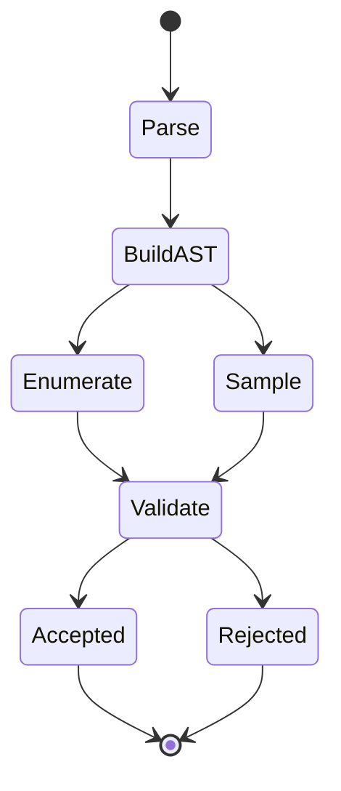

# Mission Brief - Regex Generation as Controlled Intelligence

## 1. Why This Matters

Regular expressions are often taught as syntax. In production systems, they are control policies over strings.

This lab reframes regex as a **symbolic control program**:
- It specifies what trajectories are legal.
- It rejects impossible trajectories.
- It can produce legal trajectories for testing and simulation.

## 2. Visual Mental Model



Interpretation:
- `Parse` is compilation.
- `BuildAST` is structured policy creation.
- `Enumerate/Sample` are decoding modes.
- `Validate` is the hard safety gate.

## 3. Real-World Analogy: Air Traffic Control

Think of each generated string as a flight path.

- Regex rules are air corridors.
- Alternation (`A|B`) is route branching.
- Repetition (`*`, `+`) is loiter/retry behavior.
- Repeat cap is fuel and airspace safety limit.
- Validation is tower clearance check.

Without constraints, you risk trajectory explosion (combinatorial growth). With bounded rules, you keep operations safe and analyzable.

## 4. Machine Learning Analogy: Constrained Decoding

In constrained text generation (for example constrained beam search), systems force outputs to contain required structures/phrases.

This lab performs the symbolic equivalent:
- AST is the constraint graph.
- Generator explores feasible branches only.
- Bounded repetition acts as regularization.
- Full-match verification is hard post-check.

Practical consequence: you get controllable output quality, not just random text.

## 5. Engineering Insight

### Deterministic mode
- Best for coverage and regression tests.
- Produces reproducible language samples.

### Random mode
- Best for stochastic probing and exploratory fuzzing.
- Produces varied but still valid strings.

### Trace mode
- Best for explainability and debugging.
- Shows exactly why a word is valid.

## 6. Useful Scenarios

1. Parser test corpus generation.
2. Input contract validation stress tests.
3. DSL tokenizer smoke tests.
4. Teaching formal language constraints with concrete traces.

## 7. Command Recipes

```powershell
python 4_regular_expressions/main.py --variant all --samples 8 --validate --mission-brief
python 4_regular_expressions/main.py --variant 2 --samples 10 --show-steps --mission-brief
python 4_regular_expressions/main.py --variant all --show-steps --export-mermaid-dir 4_regular_expressions/reports/visuals
```

## 8. Bottom Line

This is no longer just "generate strings from regex".

It is a compact, explainable, bounded language-generation platform that links classical formal language theory to modern constrained generation concepts in AI systems.
