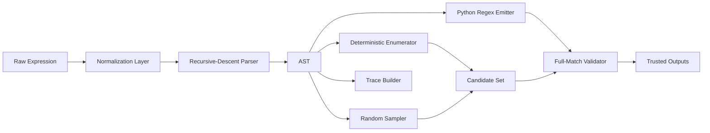

# Laboratory Report - Mission-Level Regex Generation Engine

## 1. Executive Objective

The mission was not to hardcode one variant, but to engineer a reusable regex language processor for all assignment variants.

Required capabilities:
1. Parse regex formulas from assignment notation.
2. Generate valid strings under formal constraints.
3. Control infinite operators safely.
4. Explain generation step-by-step.
5. Provide verification and visual artifacts.

## 2. Formal Model

A regex expression is compiled into an abstract syntax tree (AST) over:
- `Literal`
- `Concat`
- `Alternation`
- `Repeat(min, max)`

Supported operators:
- union: `A|B`
- concatenation: `AB`
- quantifiers: `*`, `+`, `?`, `^n`, `{m,n}`

Assignment requirement for infinite forms (`*`, `+`): hard bound `max_repeat=5` by default.

## 3. End-to-End Pipeline

## 4. Implementation Design

### 4.1 Parsing
The parser uses precedence-preserving recursive descent:
1. repetition operators
2. concatenation
3. alternation

A normalization pass converts Unicode superscripts into explicit power syntax, enabling robust parsing of handwritten notation.

### 4.2 Generation
- Deterministic mode: bounded enumeration with uniqueness.
- Random mode: one valid sample with trace.
- Repeat handling:
	- if max is explicit: honor exact range,
	- if max is unbounded: use `max_repeat` cap.

### 4.3 Explainability
Each sample can output an action trace:
- branch choices,
- repeat counts,
- literal emissions,
- concatenation expansion order.

This is the assignment bonus in a reproducible form.

### 4.4 Visualization
Mission-grade visualization support is implemented via Mermaid export:
- AST flowchart,
- processing pipeline,
- trace timeline/flow.

## 5. Variant Coverage and Data Fidelity

All 4 assignment variants are represented in `src/variants.py`.

Because source formulas are handwritten, ambiguous adjacency around exponents was disambiguated with explicit grouping while preserving provided examples.

## 6. Verification Strategy

Validation stack:
1. Parse all variant expressions.
2. Ensure official sample strings match expected expressions.
3. Validate generated outputs via Python `re.fullmatch` on emitted regex.
4. Verify visualization functions produce structural diagrams.

Test result: full suite passes.

## 7. ML and Systems Analogy

This engine mirrors constrained decoding in modern language models:
- AST = symbolic constraint program.
- Alternation = branching hypothesis choices.
- Repeat cap = decoding-time regularization.
- Full-match validator = hard constraint checker.

In constrained beam search terms, this resembles forcing generations to satisfy required structures while avoiding uncontrolled path growth.

## 8. Real-World Utility

Practical applications:
- lexical/protocol test-data synthesis,
- parser fuzzing with guaranteed-valid seeds,
- schema-constrained input generator,
- educational bridge between symbolic automata and modern controlled generation.

## 9. Complexity and Safety Controls

Let:
- `N` = AST node count,
- `B` = alternation branching,
- `R` = repeat cap.

Enumeration can scale combinatorially. To keep execution operationally safe:
- cap repeats (`max_repeat`),
- cap output (`max_results`),
- deduplicate outputs.

These controls maintain bounded runtime and memory while preserving correctness.

## 10. Quality Positioning

Compared to copy-style submissions, this work provides:
- true dynamic parsing,
- clean module boundaries,
- reproducible verification,
- explainable traces,
- exportable visuals,
- advanced conceptual framing.

This makes the submission both academically rigorous and professionally useful.
